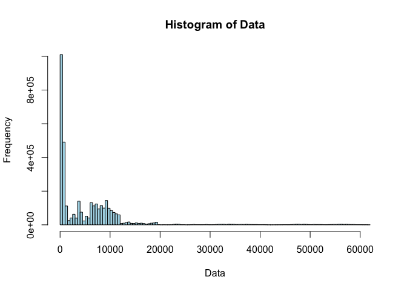
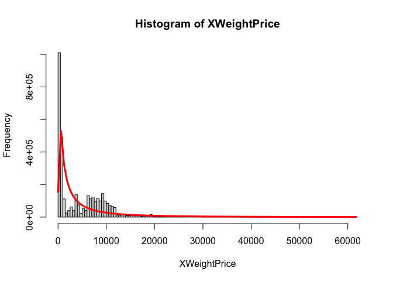

SA2
================
Karl Isaiah Buenafe, Jan Edward Macagba
2024-05-09

    ## ── Attaching core tidyverse packages ──────────────────────── tidyverse 2.0.0 ──
    ## ✔ dplyr     1.1.4     ✔ readr     2.1.5
    ## ✔ forcats   1.0.0     ✔ stringr   1.5.1
    ## ✔ ggplot2   3.4.4     ✔ tibble    3.2.1
    ## ✔ lubridate 1.9.3     ✔ tidyr     1.3.1
    ## ✔ purrr     1.0.2     
    ## ── Conflicts ────────────────────────────────────────── tidyverse_conflicts() ──
    ## ✖ dplyr::filter() masks stats::filter()
    ## ✖ dplyr::lag()    masks stats::lag()
    ## ✖ dplyr::select() masks MASS::select()
    ## ℹ Use the conflicted package (<http://conflicted.r-lib.org/>) to force all conflicts to become errors

``` r
XO=X$Open
XH=X$High
XL=X$Low
XB=X$Volume_.BTC.
XC=X$Volume_.Currency.
XWP=X$Weighted_Price
summary(XO)
```

    ##    Min. 1st Qu.  Median    Mean 3rd Qu.    Max. 
    ##     3.8   443.9  3597.0  6009.0  8627.3 61763.6

``` r
summary(XH)
```

    ##    Min. 1st Qu.  Median    Mean 3rd Qu.    Max. 
    ##     3.8   444.0  3598.2  6013.4  8633.0 61781.8

``` r
summary(XL)
```

    ##    Min. 1st Qu.  Median    Mean 3rd Qu.    Max. 
    ##     1.5   443.5  3595.6  6004.5  8621.1 61673.6

``` r
summary(XC)
```

    ##     Min.  1st Qu.   Median     Mean  3rd Qu.     Max. 
    ##        0      452     3810    41763    25698 13900672

``` r
summary(XB)
```

    ##     Min.  1st Qu.   Median     Mean  3rd Qu.     Max. 
    ##    0.000    0.410    1.980    9.323    7.278 5853.852

``` r
summary(XWP)
```

    ##    Min. 1st Qu.  Median    Mean 3rd Qu.    Max. 
    ##     3.8   443.8  3596.8  6008.9  8627.6 61716.2

``` r
XWeightPrice=X$Weighted_Price
fit=fitdistr(XWeightPrice,'lognormal')
fit
```

    ##      meanlog         sdlog    
    ##   7.6028763729   1.7296559491 
    ##  (0.0009098704) (0.0006433755)

``` r
hist(XWP, breaks = 100, col = "Lightblue"
, main = "Histogram of Data",
xlab = "Data", ylab = "Frequency")
```

<!-- -->

``` r
mean=fit$estimate['meanlog']
sd=fit$estimate['sdlog']
mean
```

    ##  meanlog 
    ## 7.602876

``` r
sd
```

    ##    sdlog 
    ## 1.729656

``` r
x = seq(min(XWeightPrice), max(XWeightPrice), length = 100)

lnormal_density = dlnorm(x, mean = mean, sd = sd)


scaled_density = lnormal_density * length(XWeightPrice) * diff(hist(XWeightPrice,breaks=100)$breaks [1:2])

lines(x, scaled_density, col = "red", lwd = 3)
```

<!-- -->
